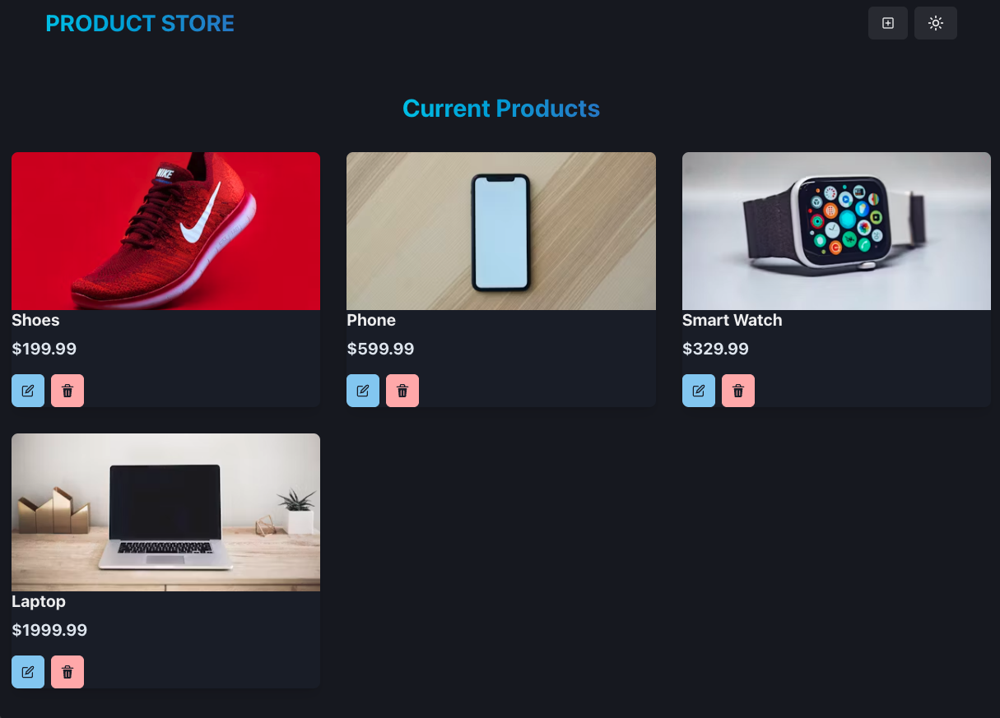
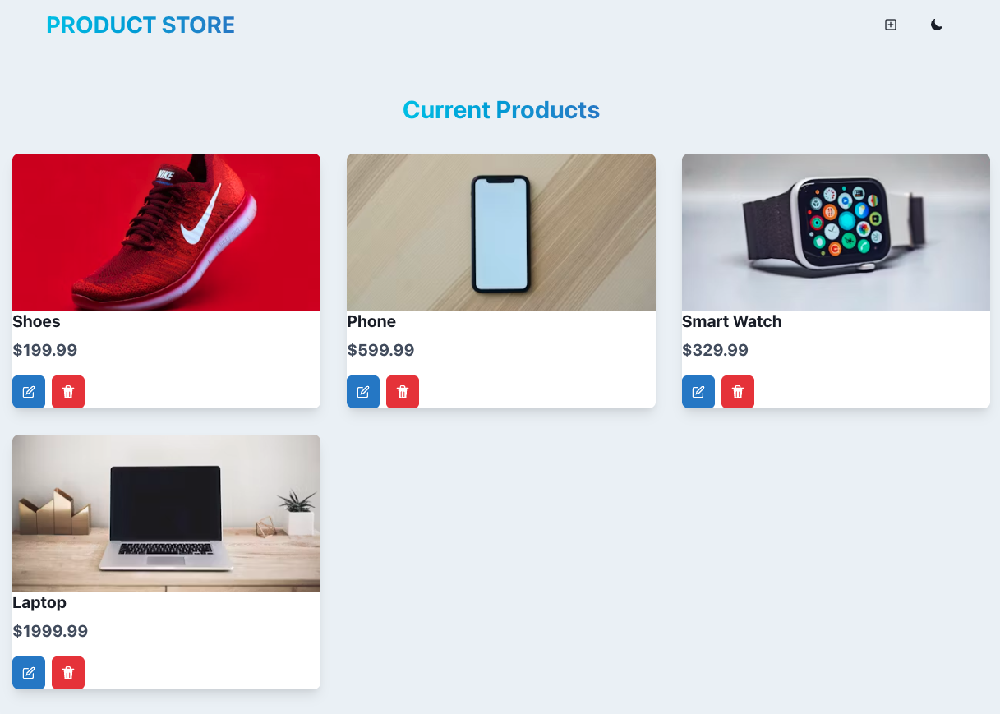
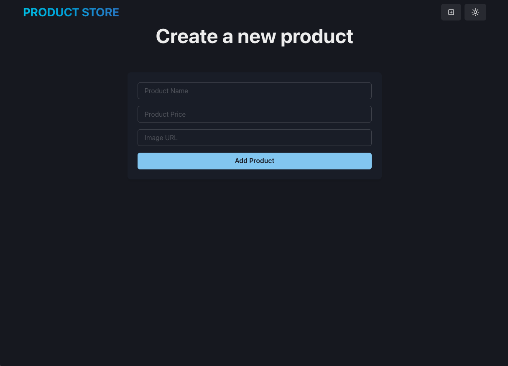
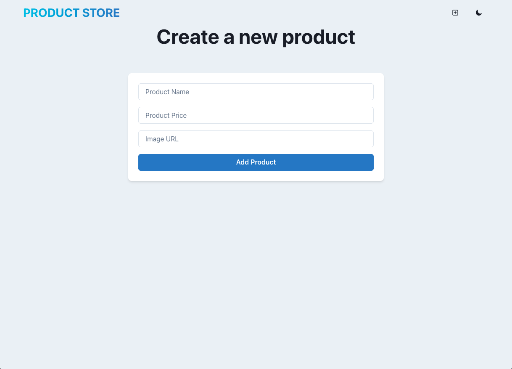
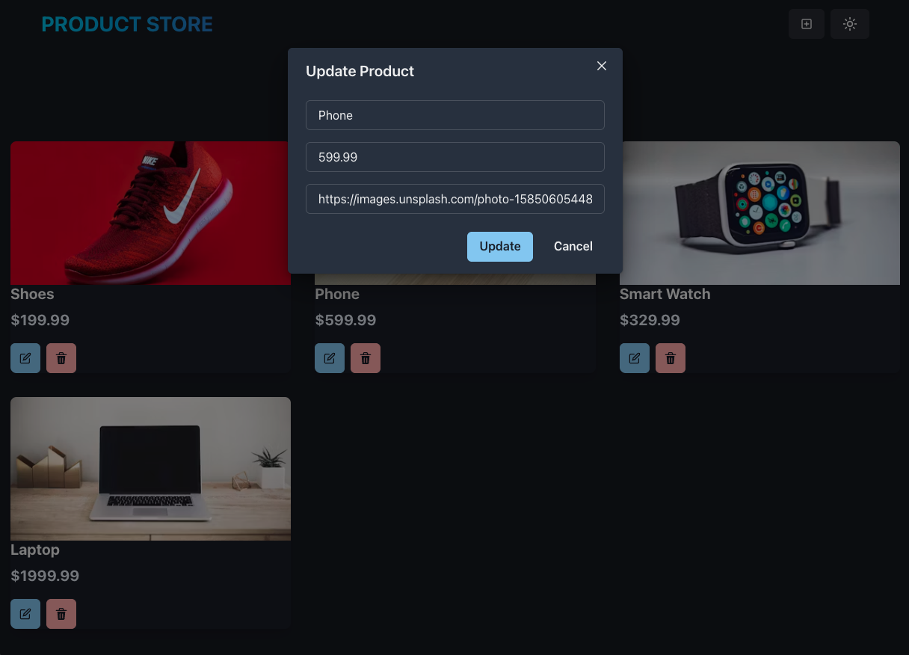
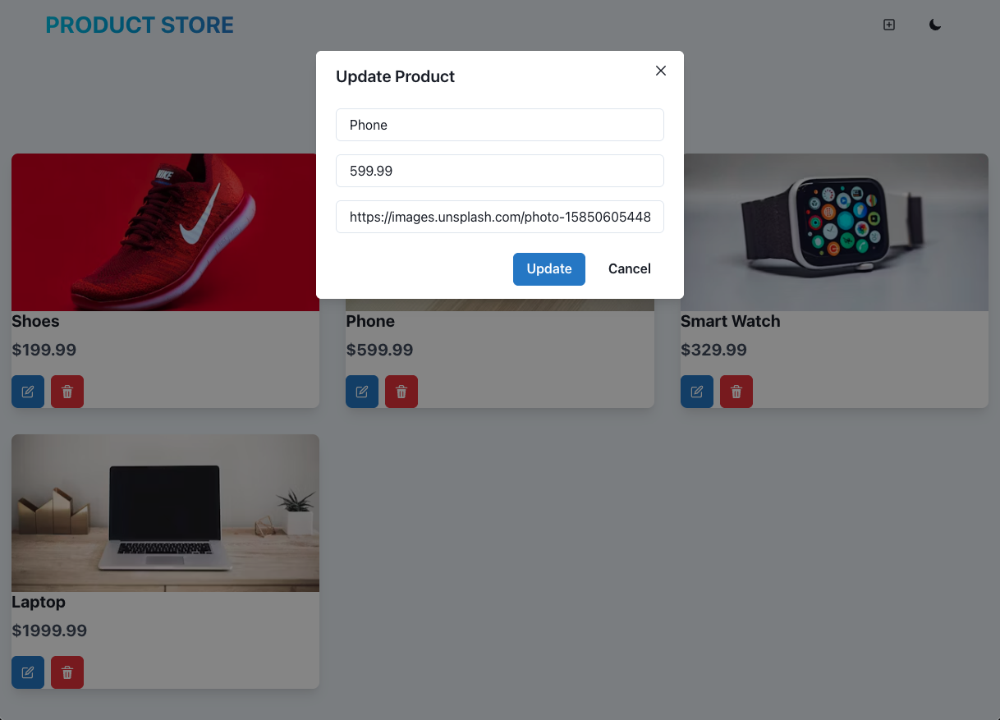
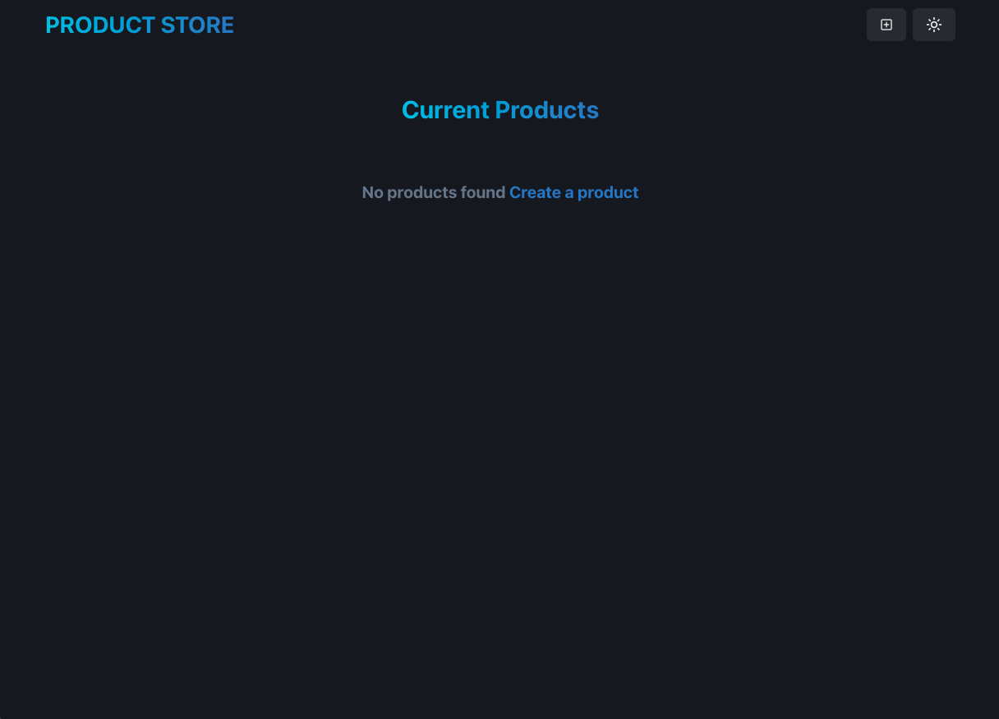
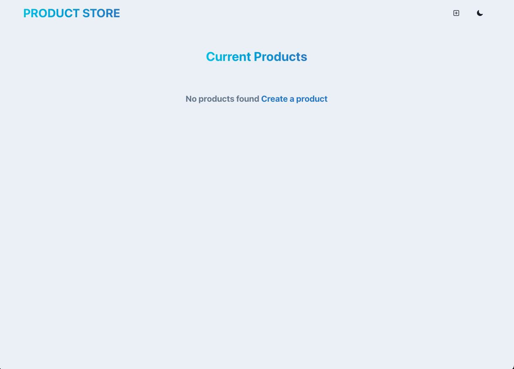

# 💰 ShopProject
A full-stack MERN (MongoDB, Express, React, Node.js) application for managing products. The project features a backend API for CRUD operations and a modern React frontend using Chakra UI for styling.

---

## 📸 Screenshots

📂 Click to expand screenshots

### 🏠 Home Page

<table>
  <tr>
    <td align="center"><b>Dark Mode</b> </td>
    <td align="center"><b>Light Mode</b> </td>
  </tr>
</table>

### ➕ Create Product

<table>
  <tr>
    <td align="center"><b>Dark Mode</b> </td>
    <td align="center"><b>Light Mode</b> </td>
  </tr>
</table>

### 📝 Update Product

<table>
  <tr>
    <td align="center"><b>Dark Mode</b> </td>
    <td align="center"><b>Light Mode</b> </td>
  </tr>
</table>

### 📭 No Products Found

<table>
  <tr>
    <td align="center"><b>Dark Mode</b> </td>
    <td align="center"><b>Light Mode</b> </td>
  </tr>
</table>

---

## 🚀 Features

- View, create, update, and delete products
- Responsive UI with Chakra UI
- State management with Zustand
- RESTful API with Express and MongoDB (via Mongoose)
- Environment-based configuration
- Hot reloading for both frontend and backend

---

## 🖥️ Frontend

- **Framework:** React (with Vite)
- **Styling:** Chakra UI
- **Routing:** React Router DOM
- **State Management:** Zustand

---

## 🔧 Backend

- **Framework:** Express.js
- **Database:** MongoDB (via Mongoose)
- **API:** RESTful endpoints for product management

### API Endpoints

| Method | Endpoint              | Description                |
|--------|-----------------------|----------------------------|
| GET    | `/api/products`       | Get all products           |
| POST   | `/api/products`       | Create a new product       |
| PUT    | `/api/products/:id`   | Update a product           |
| DELETE | `/api/products/:id`   | Delete a product   

---

### 💡 Main Features

- **Home Page:** Lists all products, each with options to edit or delete.
- **Create Page:** Form to add a new product.
- **Product Card:** Edit and delete actions via modal and buttons.
- **Navbar:** Navigation and color mode toggle.

---
